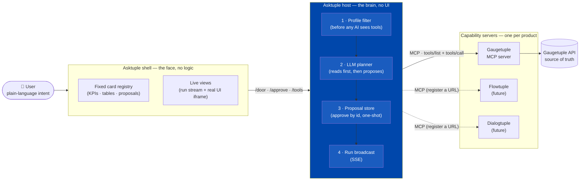
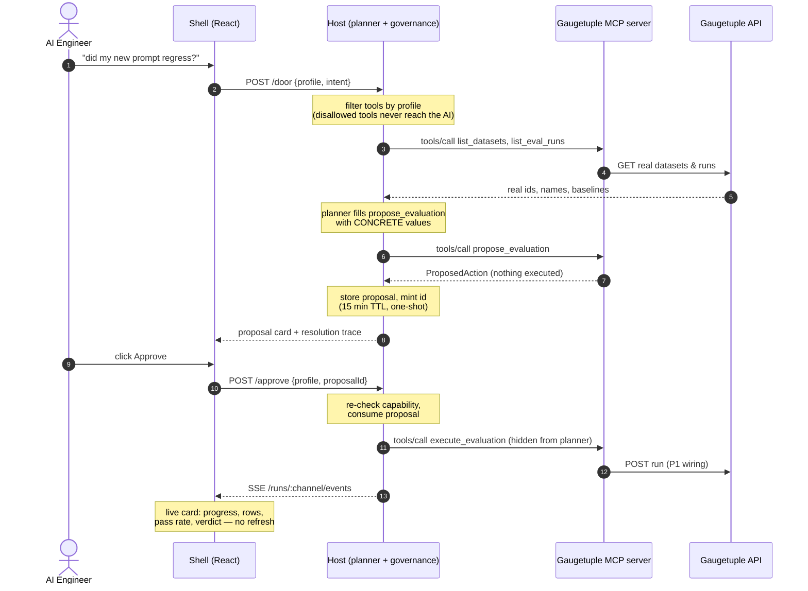
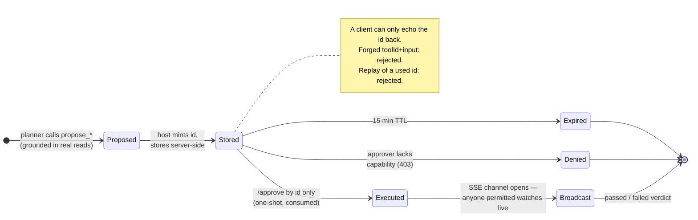
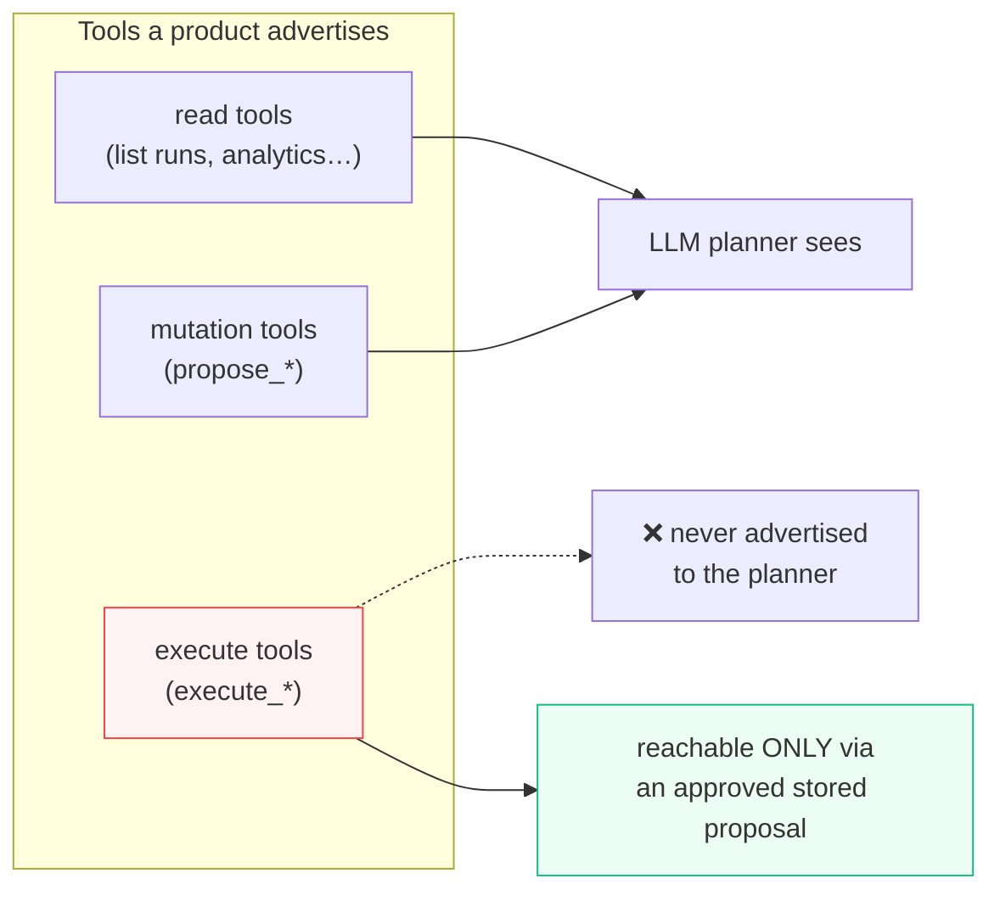
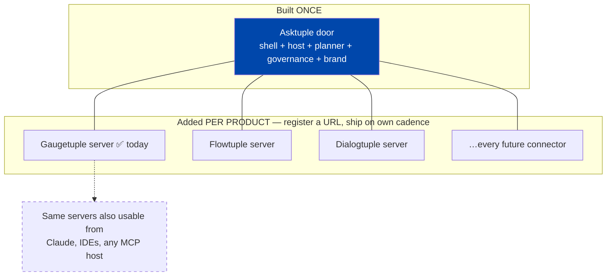

# Asktuple — Executive Explainer

**One natural-language door to every Newtuple product.**
Status: working prototype, demo-ready. This document covers the intent, the
architecture, how a request is orchestrated, what is proven today, and the
blockers between here and a real product.

---

## 1. The intent

Newtuple's products work; adoption is the problem. Gaugetuple is the proof
case: running a trustworthy evaluation is a five-screen ritual (golden dataset →
criteria → pipeline → run → analytics), and every screen assumes the user
already knows evaluation methodology. The live dashboard tells the story —
**59 runs, 53 criteria, 2,346 rows… and 0 golden datasets**. People run evals
but skip the structured setup that makes results defensible, because the
ceremony is too heavy.

Asktuple replaces the ceremony with a sentence:

> "Did my new prompt regress against the current one?"

The system works out who is asking, what they are allowed to do, what real
data the request refers to, and assembles the right interface — a KPI board, a
run table, or a ready-to-approve action. Nothing that changes data ever runs
from language alone: mutations come back as **proposals** a human approves.

The same door then extends to Flowtuple, Dialogtuple, and every future
connector — by *adding a server*, never by rebuilding the front end.

## 2. Who it serves (one surface, four lenses)

The insight from the Gaugetuple walkthrough: internal and business users use
the **same features from different angles**. Run History is a regression audit
to an engineer and a release-readiness check to a delivery lead. So Asktuple
does not build four feature sets — it builds one capability surface and scopes
it by profile:

| Profile | Angle | Can do |
|---|---|---|
| AI Engineer | build | read everything, run evaluations & prompt jobs |
| Eval Engineer | build | all of the above + author golden datasets, export reports |
| Delivery Lead / PM | ship decision | reads, run standard evaluations, export reports |
| Client / Leadership | read-only | dashboards, live run broadcasts, reports — no mutation |

Scoping is enforcement, not presentation: a profile's disallowed tools are
never in its tool list, so the language model cannot even select them, and
approval is re-checked server-side.

## 3. The architecture

Three pieces, strict responsibilities:

- **Capability servers (one per product, real MCP protocol).** Each product
  advertises typed tools with metadata: the capability required, the kind
  (read / mutation / execute), and the card the result renders into. Because
  this is standard MCP, any MCP-compatible host — not just Asktuple — can
  consume a product's server. Adding a product = registering a URL.
- **The host (the brain, no UI).** Discovers tools, filters them by the
  caller's profile *before* any AI sees them, runs the planner, stores
  proposals, executes approvals, streams run broadcasts.
- **The shell (the face, no logic).** Renders results from a fixed card
  registry — the model selects tools and fills inputs; it never paints UI and
  never fabricates data. Same request, same interface, every time.

Four rules the code enforces (the trust contract):

1. **Truth boundary** — every fact on screen comes from a product API. An
   unreachable source renders a degraded card, never a guess.
2. **Predictable UI** — fixed card vocabulary; the model cannot invent
   interface.
3. **Capability scoping at the tool boundary** — filtering happens before
   intent resolution and is re-checked at approval.
4. **Governed mutation** — mutations return proposals; proposals are stored
   server-side, approved by id only, one-shot, expiring. A client cannot
   craft and self-approve an action.

## 4. Orchestration of one request

"Did my new prompt regress against the current one?" (AI Engineer):

1. Shell posts `{profile, intent}` to the host.
2. Host takes the profile's tool list (mutations the profile lacks are simply
   absent) and gives it to the **planner** — an LLM agentic loop
   (claude-opus-4-8) bound to those tools only.
3. Planner **reads first**: lists datasets and recent runs over MCP to find
   the real dataset ids, names, and the baseline in question.
4. Planner calls `propose_evaluation` with concrete values. The proposal —
   what will execute, its effects in plain language, the capability it needs —
   is stored server-side with a minted id and rendered as a card.
5. User clicks **Approve**. Host re-checks capability, consumes the proposal
   (one-shot), and calls the hidden `execute_*` tool. The planner can never
   reach execute tools; only an approved proposal can.
6. A **broadcast channel** opens: the run streams live over SSE — progress,
   rows scored, rolling pass rate, final verdict — into a native card anyone
   permitted can watch, including read-only leadership.
7. Optionally, the **live view** embeds the real Gaugetuple UI in-frame,
   deep-linked to where the work is happening (Run History after an approval).

Transparency is built in: every answer shows which tool resolved it, whether
the planner or the offline fallback routed it, and which reads grounded it.

The mutation governance in one picture — why language alone can never change
data:

And the tool-visibility rule that backs it:

## 5. What is proven today (all smoke-tested in-browser)

- End-to-end flow on realistic mock data: intent → card → proposal → approve →
  live streaming run card (progress, stats, verdict) without refresh.
- Real MCP wire protocol between host and capability server; 12 tools
  discovered dynamically; execute tools invisible to every profile.
- Governance paths: forged approve body rejected, replayed proposal rejected,
  read-only profile denied at approval (403) and at planning (tool absent).
- Live reads wired to the real Gaugetuple endpoints (observed and documented);
  degraded cards when no session exists.
- Live Gaugetuple UI renders interactively inside the shell (iframe), with a
  Chrome helper extension for session embedding and endpoint capture.

## 6. Blockers to a real product (priority order)

| # | Blocker | What it takes | Owner |
|---|---|---|---|
| 1 | **LLM credentials** — planner currently falls back to keyword routing on machines without an Anthropic key | Provision `ANTHROPIC_API_KEY` for the host | Ops (minutes) |
| 2 | **Mutation endpoints unobserved** — run-evaluation, dataset-create, export are stubs | Click through the three flows once with the capture extension; paste the recorded requests; wire `executeApproved()` | Shailesh + eng (hours) |
| 3 | **Service identity for Gaugetuple** — gateway currently uses a human's session cookie | Add a service-token path to Gaugetuple; per-user credentials so audit trails are true | Gaugetuple team |
| 4 | **Real authorization** — profile is a client-supplied dropdown for the demo | Derive profile from SSO/authtuple session (single hook exists: `resolveProfile()`); mirror Gaugetuple's real role model so `PROFILE_CAPABILITIES` cannot drift | Eng |
| 5 | **Real run telemetry** — broadcast is simulated pending #2 | Swap the simulator for a status poller on the created run (same event vocabulary; UI unchanged) | Eng (small) |
| 6 | **Second product** — proves the "add a server, not a rewrite" claim | Stand up a Flowtuple MCP server against this contract | Product teams |

None of these are architectural risks; they are wiring and access. The
governance, protocol, planner, and UI layers are built and tested.

## 7. Why this wins as "the single door"

- **Additive scale.** Each tuple product owns its capability server and ships
  tools on its own cadence. The door, the planner, the approval flow, and the
  brand surface are written once.
- **Standards-aligned.** Real MCP means the same servers serve Claude, IDEs,
  or any future MCP host — the connector investment is not captive to one UI.
- **Trust by construction.** The model cannot see disallowed tools, cannot
  execute mutations, cannot invent data, cannot paint UI. Governance is
  enforced in the host, not promised in a prompt.
- **Adoption lever.** The eval expertise lives in the planner (which datasets,
  which criteria, what baseline) — turning the five-screen ritual into a
  sentence plus one approval, which is precisely the gap the 0-golden-datasets
  number exposes.

*Repo: github.com/shailesh-svg/Asktuple · Details: README.md,
docs/ARCHITECTURE.md, docs/PROFILES.md, docs/HANDOFF.md (execution plan with
acceptance criteria).*
