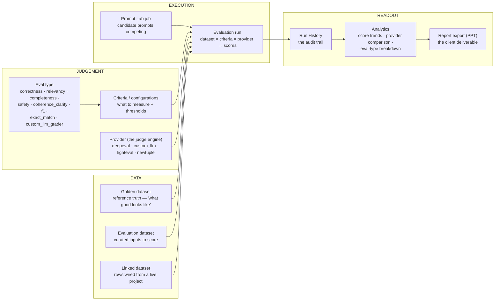
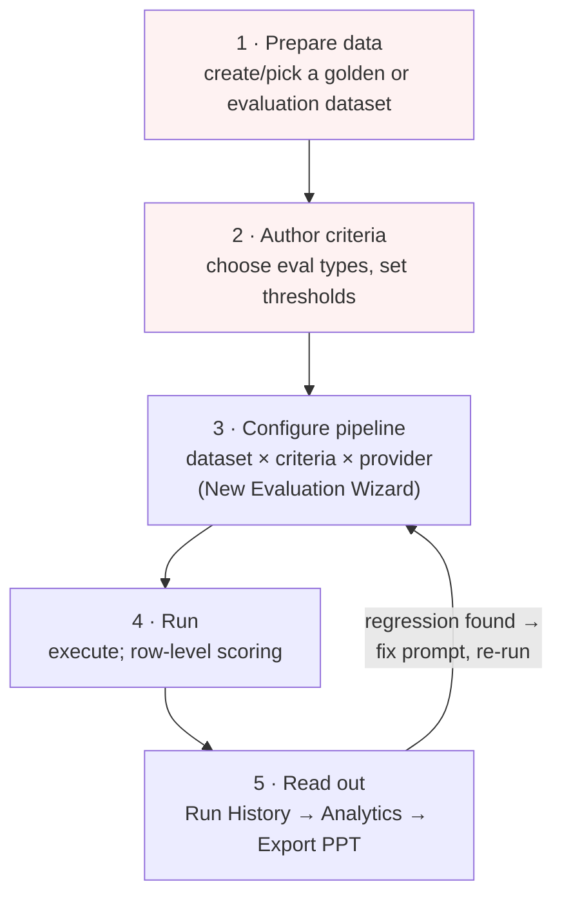
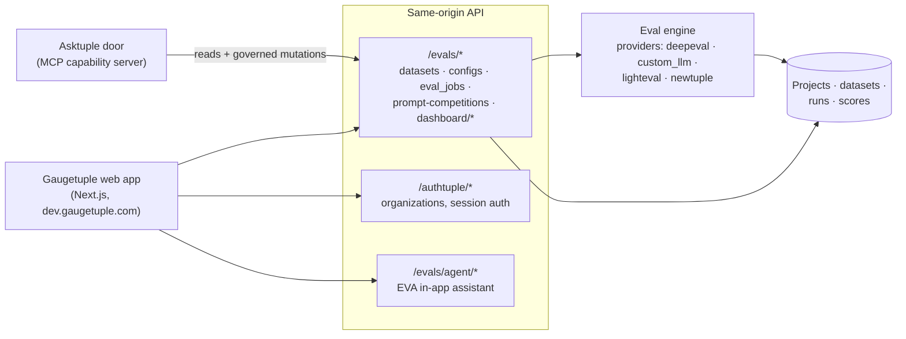

# Gaugetuple — Platform Documentation

What Gaugetuple is, how an evaluation actually works, and how its pieces fit —
for humans onboarding onto the platform and for agents planning against it.
Written from the observed live platform (dev.gaugetuple.com); anything inferred
rather than observed is marked *(inferred)*.

---

## 1. What Gaugetuple is

Gaugetuple is Newtuple's **AI evaluation platform**: it scores AI outputs
(prompts, models, pipelines) against datasets and criteria, tracks those scores
over time, and turns them into evidence — regression checks for engineers,
release-readiness for delivery leads, quality reports for clients.

Live platform state (the numbers that motivated Asktuple):

| Metric | Value | Meaning |
|---|---|---|
| Total evaluations | 59 | runs executed |
| Eval criteria | 53 | scoring configurations authored |
| Linked datasets | 14 (2,346 rows) | data wired to projects |
| Golden datasets | **0** | reference baselines — the adoption gap |
| Evaluation datasets | **0** | curated eval sets — same gap |

People run evaluations but skip the structured setup that makes results
defensible. That's the problem both this documentation and the Asktuple door
exist to fix.

## 2. Core concepts (the vocabulary)

- **Golden dataset** — the reference set: inputs with known-good outputs.
  Baselines for every future comparison. A regression check without one is an
  opinion, not evidence.
- **Evaluation dataset** — a curated set of inputs to score (may lack golden
  answers; judged by criteria instead).
- **Linked dataset** — rows flowing from a live project (e.g. real support-bot
  conversations). Today all 14 datasets are linked: real traffic, no curated
  truth.
- **Criteria / configurations** — what to measure and where the bar is
  (e.g. "Factual accuracy ≥ 0.8"). 53 exist.
- **Eval type** — the scoring method: `correctness`, `relevancy`,
  `completeness`, `safety`, `coherence_clarity`, `f1`, `exact_match`,
  `custom_llm_grader`.
- **Provider** — the judging engine that computes scores: `deepeval`,
  `custom_llm`, `lighteval`, `newtuple`.
- **Evaluation run** — one execution: dataset × criteria × provider → row-level
  scores, pass rate, verdict. Lands in Run History.
- **Prompt Lab job** — candidate prompts competing against each other; the
  winner becomes the new baseline *(inferred from the Prompt Lab UI)*.
- **Analytics** — score trends, provider comparison, eval-type breakdown,
  scoped per project.

## 3. The evaluation workflow (the five-screen ritual)

This is the flow Gaugetuple's UI expects — and the ceremony Asktuple
compresses into a sentence:

Steps 1–2 are where adoption dies (red): they demand evaluation methodology
knowledge before any value appears. Users skip to 3–4 with linked data, which
is why 59 runs coexist with 0 golden datasets.

**A defensible regression check** ("did my new prompt regress?") needs:
1. A dataset both prompt versions run against (ideally golden).
2. The same criteria and provider for both runs.
3. Compare pass rates / per-criterion scores between runs.

## 4. Platform architecture

*(observed surface; internals inferred)*

Key API surfaces (full endpoint list in `GAUGETUPLE_API.md`):

| Surface | Endpoint family |
|---|---|
| Datasets | `GET /evals/dataset/list?type=golden\|evaluation\|linked` |
| Criteria | `GET /evals/configs/list` |
| Runs | `GET /evals/eval_jobs/list` |
| Prompt Lab | `GET /evals/prompt-competitions` |
| Analytics | `GET /evals/dashboard/project-*` |
| Auth | session cookie via `/authtuple/*` |
| Mutations | not yet captured — see HANDOFF P1 |

## 5. Who uses it, from what angle

Same features, four angles (full mapping in `PROFILES.md`):

| Feature | Engineer's angle | Business angle |
|---|---|---|
| Run History | "did my prompt regress?" | "is it ready to ship?" |
| Analytics | "why did the score drop?" | "trend for the client report" |
| New Evaluation | "A/B my candidate prompt" | "test against our standard" |
| Export PPT | (rare) | the deliverable |

## 6. How agents should reason about Gaugetuple

Rules the Asktuple planner follows (also shipped to any MCP host via the
capability server's instructions):

1. **Ground before proposing.** Never propose an evaluation with an empty or
   invented dataset id — list datasets/runs first, use real ids and names.
2. **Golden gap is real.** There are no golden datasets today; a regression
   check will usually run on a linked dataset. Proposing to *create* a golden
   set from good linked rows is high-value.
3. **Type follows intent.** "Regressed?" → `correctness`. "Safe/compliant?" →
   `safety`. "On-topic?" → `relevancy`. "Word-for-word?" → `exact_match`.
4. **Provider default** is `deepeval` unless the user names one.
5. **Reads are free, mutations are governed.** Anything that creates a run,
   dataset, or report returns a proposal a human approves.
